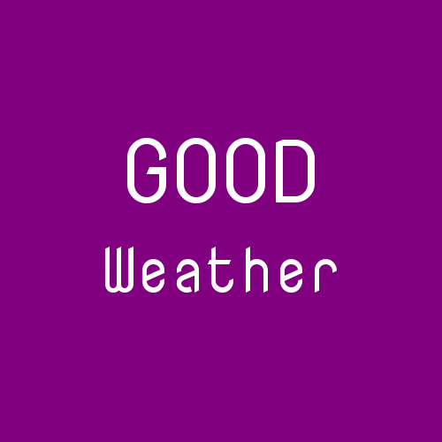

# GOOD Weather (React)

# Project description
Simple React app made as my final project during Coders Lab frontend bootcamp.
Utilizes the functional programming principle, with all but one components being pure functions.
Holds state in a single root component, with necessary data passed to child components as props.

Current functionality includes:
<ul>
  <li>current weather, forecast and pollution data views for any given location found in OpenWeatherMap database</li>
  <li>geolocation through browser geolocation API</li>
  <li>dynamic styling of the pollution view</li>
  <li>mobile orientated styling</li>
</ul>

# APIs utilized

[OpenWeatherMap API](https://openweathermap.org/api) for weather data (current and forecast).
[Airly API](https://airly.eu/pl/api/) for pollution data (CAQI, PM10, PM2.5).

# 3rd party assets
Search and geolocation icons made by Google, downloaded from [FlatIcon](http://www.flaticon.com).

# Screenshots

  
  
  
 

